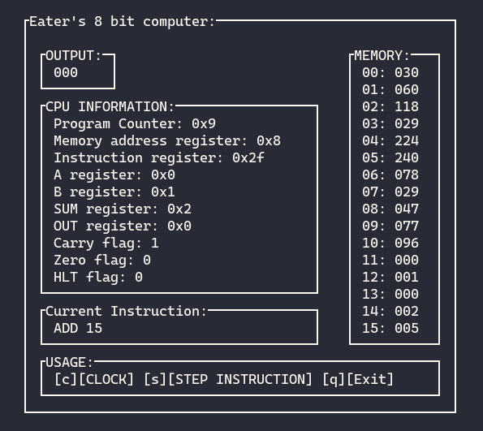

# Ben Eater's 8 bit computer emulator
This is complete [ben eater's 8 bit breadboard computer](https://www.youtube.com/watch?v=HyznrdDSSGM&list=PLowKtXNTBypGqImE405J2565dvjafglHU) emulator written in C.

## Featerus
- Ncurses graphics
- Assembler (You can directly load assembly file)
- Allows to step through each instruction or each clock pulse (each microcode)
- Shows CPU information and memory contents
## Installing
Ncurses should be installed. (It is probably already installed.)
```
git clone https://github.com/kapilpokhrel/eater-8bitemu.git
cd eater-8bitemu
make
```
## Usage
```
./8bitemu -b binary_file
```
or
```
./8bitemu -a assembly_file
```
## Assembler
The current assembler is very simple that also supports ***label***, ***comment*** and ***mathematical expressions***. It also report the errors with line number.

Here is the program to multiply 3 and 5:
```
top:
	lda x
	sub one ; sub subtracts the A from content of given memory address
	jc continue
	lda product
	out
	hlt
continue:
	sta x
	lda product
	add y
	sta product
	jmp top
	0
one:1
product:0
x:	3
y:	5
```
# TODO
- [x] Complete Emulation with all instruction
- [x] Assembler
- [x] Step through each microcode
- [x] Ncurses Output
- [ ] Option to change memory contents and register value.
